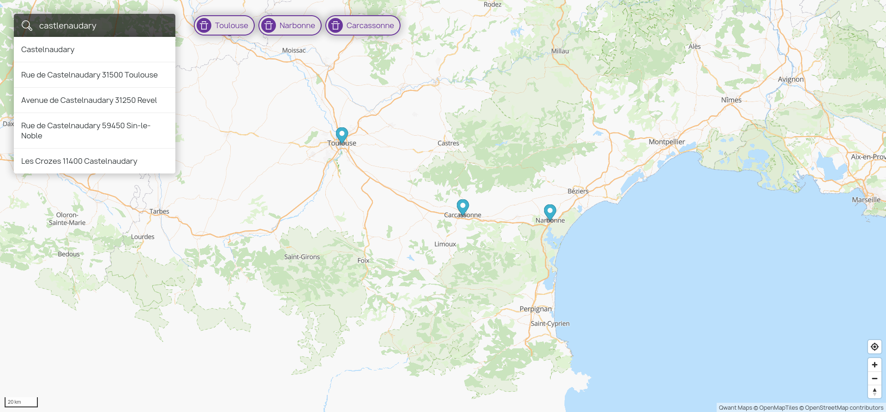

# Simplestreetmap

Another open source frontend map based on OSM data. A demo is available at [https://maps.ppsfleet.navy/toulouse](https://maps.ppsfleet.navy/toulouse)

## Installation

Edit `config.js` with your own search, reverse, and tile server.

Edit `index.html` to import maplibre from your server or some CDN.

That's all, put it behind the server of your choice. For dev, I use PHP with `php -S localhost:<port>`.

## Install a search and reverse server:

I use ADDOK: `https://addok.readthedocs.io/en/latest/`, it's quite easy to install and works very well with french addresses.

There are other. Qwant maps uses `https://github.com/CanalTP/mimirsbrunn`

## Serving tiles

For a small server, there is `https://openmaptiles.org/`. Qwant maps uses a more complex stack, see `https://github.com/Qwant/qwantmaps`

If you don't want to host tiles yourself, maptiler or mapbox offer hosting solutions.

You can use ppsfleet tiles for testing, but only for testing.

