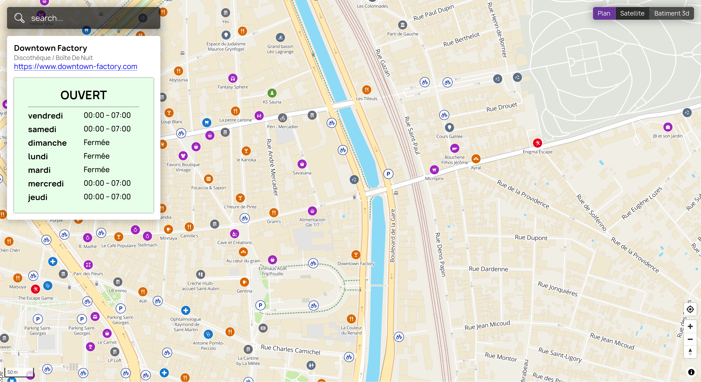

# Simplestreetmap

Another open source frontend map based on OSM data. A demo is available at [https://maps.ppsfleet.navy/toulouse](https://maps.ppsfleet.navy/toulouse)



## Installation

The map layer lives in the [`esquisse`](https://github.com/tjiho/esquisse) submodule, so clone with it:

```
git clone --recurse-submodules <repo>
# or, if already cloned:
git submodule update --init --recursive
```

Edit `config.js` with your own search / reverse / tile servers and default view:

- `DEFAULT_CENTER` / `DEFAULT_ZOOM` — initial view when no `?map=` in the URL.
- `BASE_MAP_URL` — base map style.
- `POI_TILES_URL`, `BICYCLE_TILES_URL`, `BICYCLE_BASE_STYLE_URL`, `SATELLITE_TILES_URL`, `BATIMENT3D_TILES_URL` — per-layer sources.
- `BASE_SEARCH_URL`, `BASE_REVERSE_URL`, `BASE_OVERPASS_URL` — search / reverse / overpass endpoints.

Edit `index.html` to import maplibre from your server or some CDN.

That's all, put it behind the server of your choice. For dev, I use PHP with `php -S localhost:<port>`.

## Install a search and reverse server:

I use ADDOK: https://addok.readthedocs.io/en/latest/, it's quite easy to install and works very well with french addresses.

There are other. Qwant maps uses https://github.com/CanalTP/mimirsbrunn

## Serving tiles

For a small server, there is https://openmaptiles.org/. Qwant maps uses a more complex stack, see https://github.com/Qwant/qwantmaps

If you don't want to host tiles yourself, maptiler or mapbox offer hosting solutions.

You can use ppsfleet tiles for testing, but only for testing.


## Dev

It does not need compilation.

To check the code: `npx standard --fix`
