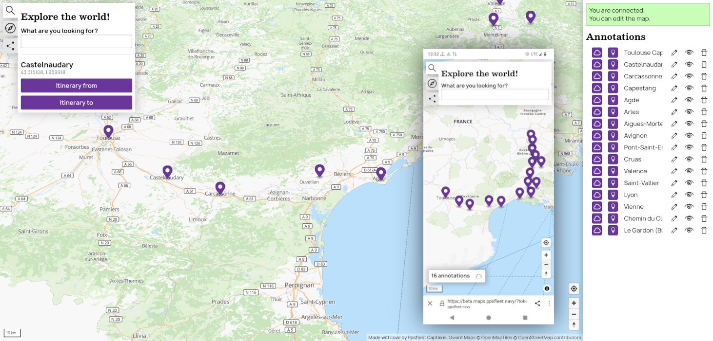

# Simplestreetmap

Another open source frontend map based on OSM data. A demo is available at [https://beta.maps.ppsfleet.navy](https://beta.maps.ppsfleet.navy)



## Installation

Edit `simplestreetmap/config.py` with your own search, mapbox/maplibre style url and the path to maplibre library.

You can add other data overlay with the key overlays:

```
'overlays': [
    {
        'tiles_url': 'some_tiles_server',
        'source_layer': 'public.cameras',
        'name': 'cameras'
    }
],
```

Then do a venv:  
`python3 -m venv env; source env/bin/activate`   
and install the project  
`pip install .`

### Init database for websocket

```
python3 websockets/main.py setup
```

## Run

### Main server

```
gunicorn -b 127.0.0.1:8088 --workers 4 'simplestreetmap:make_app()'
``` 

### Websocket

```
python3 websockets/main.py
```

## Install a search and reverse server:

I use ADDOK: https://addok.readthedocs.io/en/latest/, it's quite easy to install and works very well with french addresses.

There are other. Qwant maps uses https://github.com/CanalTP/mimirsbrunn

## Serving tiles

For a small server, there is https://openmaptiles.org/. Qwant maps uses a more complex stack, see https://github.com/Qwant/qwantmaps

If you don't want to host tiles yourself, maptiler or mapbox offer hosting solutions.

You can use ppsfleet tiles for testing, but only for testing.


## Dev

It does not need compilation.

To check the code: `npx standard --fix`
